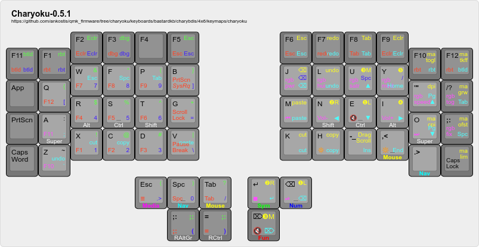
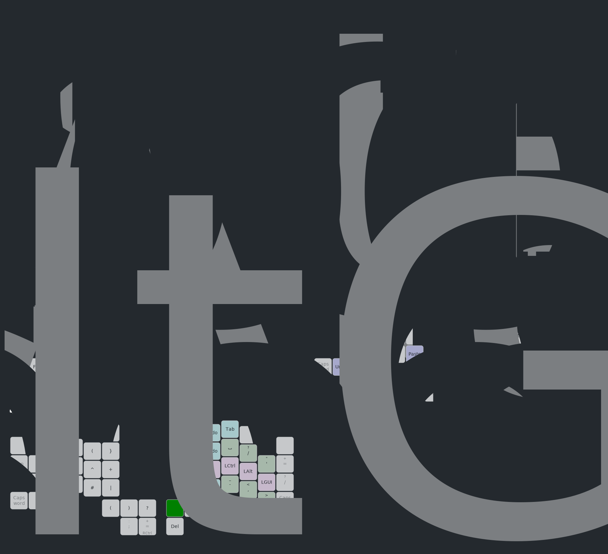

# Charybdis 4x6 VIA-Miryoku-ColemakDH keymap

A *ColemakDH-esque* keymap for the "big" *Charybdis 4x6*, with *VIA* support,
[home row mods](https://precondition.github.io/home-row-mods) and
[Miryoku-inspired layers](https://github.com/manna-harbour/miryoku):

[](http://www.keyboard-layout-editor.com/#/gists/57926252da9ebaea7a88cba9ed3bfa78)

It was announced in [this *BastardKBD* discord thread](https://discordapp.com/channels/681309835135811648/1193692606568333342)
on Jan 2024. It forked-off from *Charybdis 3x5* QWERTY based layout,
a smaller split ergo keyboard which physically contains the exact same number of
keys as the original *Miryoku* layout.  The extra keys do not contain any 
essential functionatlity, to have a gracefull degradation to 3x5 form,
like this:

- top row: Put F-keys in place of number-keys (top non-miryoku row) to facilitate
  app shortcuts with one hand, eg. *midnight commander*, *vscode*.  Besides,
  a non-char key is handy in Esc's position ;-)
- x2 bottom left thumbs: `;,` in base layer and so as to have all QWERTY keys exposed
  without layer;  space/tab for both sym & num layers.
- outer columns: caps-lock keys and nice-to-have keys like `;` and `/`.


## Features

- [x] VIA enabled
- [x] RGB matrix
- [x] ColemakDH
- [x] all x6 Miryoku-inspired layers (media, nav, mouse, sym, num, fun)
- [x] Only QWERTY shift-pairs
- [x] single-handed pointer (trackball) with mouse-buttons ergonomically close to home-row
- [x] layer-state & capslock RGB indicators
- [x] lock layers with thumb combos
- [x] Charybdis auto-mouse impl, scroll, (auto)snipping
- [x] Generalised sigmoid mouse & drag-scroll acceleration
  NOTE: maccel is not integrated yet as officially suggested,
  but facilitates experimentation with fast builds.
  - [ ] maccel configed through *via*
- [ ] Opinionated on same-side keys (unassigned in miryoku)
- [ ] Achordion (or bilateral-combinations) home-row-mods
- ...

## Layers



Original generated with the first two commands below and heavily hand-tweaked yaml 
in [*keymap-drawer*](https://keymap-drawer.streamlit.app/) before issuing
the 3rd command.
Since then, issue the 1st & 2nd commands on every release:

```shell
qmk c2json > keyboards/bastardkb/charybdis/4x6/keymaps/charyoku/assets/keylist.json
keymap parse -q keyboards/bastardkb/charybdis/4x6/keymaps/charyoku/assets/keylist.json > keyboards/bastardkb/charybdis/4x6/keymaps/charyoku/assets/charyoku-layers.yaml
keymap draw keyboards/bastardkb/charybdis/4x6/keymaps/charyoku/assets/charyoku-layers.yaml > keyboards/bastardkb/charybdis/4x6/keymaps/charyoku/assets/charyoku-layers.svg
```

:::{note}
Install *keymap-drawer* with the following command until @finrod09(burkfers) 
submits a PR to main repo:

```shell
pip install https://github.com/finrod09/keymap-drawer.git@bkb
```
:::

## Tips

- Single-hand *mouse* use, "holding" it with the R-ring-finger and clicking with the R-thumb.
- Single-hand cursor movement by holding the *nav-layer* with the R-pinky.
- Navigation keys are layed-out in a "cross" pattern (unlike *miryoku*).
  many changes in nav & mouse R-layers are due to this.
- Some of the remaining R-positions of the nav-layer are occupied by editing keys
  (eg. copy-paste/undo/redo);  those same key-positions have been adopted by all other layers,
  painted as *cyan group* in the layer map.
- Punctuation chars in the opposite R-side for the L-layers (num/sym/fun) help type 
  paths like `~/.*` and regexes like `/.*\\n|#.*//` without lifting the R-thumb,
  painted as *green group* in the layer map.
- For then R-layers (nav/mouse) there are shared keys in the L-side for the
  unreachable keys in the "holding" L-thumb;  also it mimics Ctrl+Z/X/C/V,
  so the holding key acts as "Ctrl".
- Moved the dash(`-`) from miryoku's L-thumb --> R middle-finger
  (centrally, between `h` and `,.`), to facilitate pressing it successively in a row,
  eg. `--help`.  
- The use of **sym** layer is discouraged - all symbols exist on the **num** layer,
  shifted, so that your muscle memory fits also *charybdis-3x5*, and that you can switch
  from numbers to symbols without moving your R-thumb 
  (important for those with thumbs less motile than the average millennial ;-);
  besides, many apps list keyboard shortcuts  with the *Shift* key for symbols,
  eg. `Shift+=` for the *Zoom In*.
- [](https://www.desmos.com/calculator/xkhejelty8)


---

Original Charybdis 3x5 readme follows.

This layout supports RGB matrix. However, due to space constraints on the MCU,
only a limited number of effect can be enabled at once. Look at the `config.h` file and
enable your favorite effect.

## Customizing the keymap

### Dynamic DPI scaling

Use the following keycodes to change the default DPI:

-   `POINTER_DEFAULT_DPI_FORWARD`: increases the DPI; decreases when shifted;
-   `POINTER_DEFAULT_DPI_REVERSE`: decreases the DPI; increases when shifted.

There's a maximum of 16 possible values for the sniping mode DPI. See the [Charybdis documentation](../../README.md) for more information.

Use the following keycodes to change the sniping mode DPI:

-   `POINTER_SNIPING_DPI_FORWARD`: increases the DPI; decreases when shifted;
-   `POINTER_SNIPING_DPI_REVERSE`: decreases the DPI; increases when shifted.

There's a maximum of 4 possible values for the sniping mode DPI. See the [Charybdis documentation](../../README.md) for more information.

### Drag-scroll

Use the `DRAGSCROLL_MODE` keycode to enable drag-scroll on hold. Use the `DRAGSCROLL_TOGGLE` keycode to enable/disable drag-scroll on key press.

### Sniping

Use the `SNIPING_MODE` keycode to enable sniping mode on hold. Use the `SNIPING_TOGGLE` keycode to enable/disable sniping mode on key press.

Change the value of `CHARYBDIS_AUTO_SNIPING_ON_LAYER` to automatically enable sniping mode on layer change. By default, sniping mode is enabled on the pointer layer:

```c
#define CHARYBDIS_AUTO_SNIPING_ON_LAYER LAYER_POINTER
```

### Auto pointer layer

The pointer layer can be automatically enabled when moving the trackball. To enable or disable this behavior, add or remove the following define:

```c
#define CHARYBDIS_AUTO_POINTER_LAYER_TRIGGER_ENABLE
```

By default, the layer is turned off 1 second after the last registered trackball movement:

```c
#define CHARYBDIS_AUTO_POINTER_LAYER_TRIGGER_TIMEOUT_MS 1000
```

The trigger sensibility can also be tuned. The lower the value, the more sensible the trigger:

```c
#define CHARYBDIS_AUTO_POINTER_LAYER_TRIGGER_THRESHOLD 8
```

## Layout


